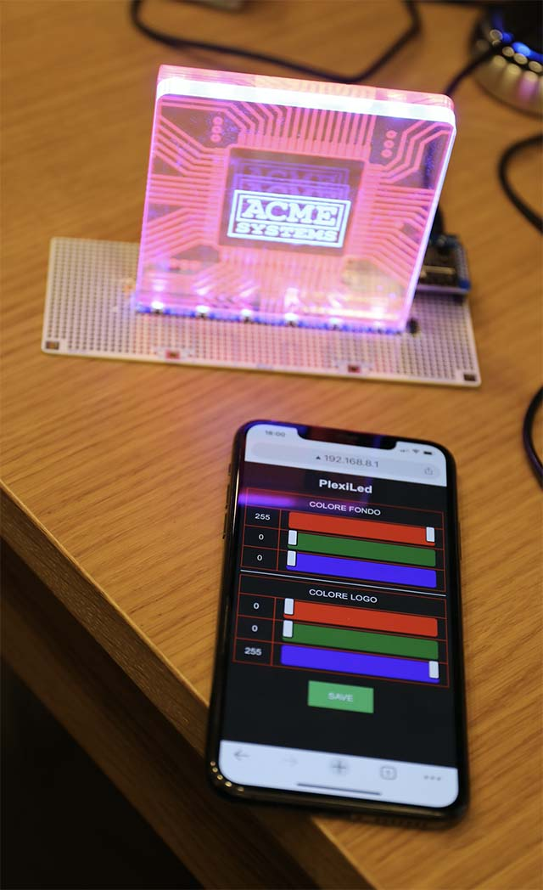

# Illuminazione per targhe in Plexiglass

Primo prototipo di programma per ESP12-F per pilotare 12 led WS2812B disposti su 
due file (fondo e fronte) per illuminare targhe in plexiglass con doppia incisione

* Si annuncia come Access Point __plexiLed__ Password __12345678__ 
* Fornisce una pagina web per il controllo distinto dei colori per lo sfondo
e il fronte
* Permette di salvare la scena colori su flash

